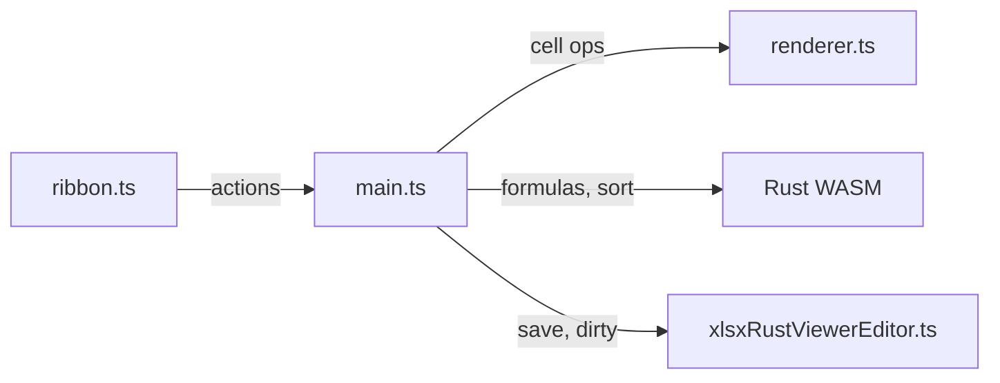

# XLSX Rust Viewer: Data Fix, Full Ribbon, and Context Menu

## Phase 1: Fix Data Display

The grid renders (columns, rows, selection) but cell data is missing. The parser
in
`[parser.rs](src/vs/workbench/contrib/void/browser/documentViewers/xlsxRustViewer/wasm/src/parser.rs)`
correctly reads XLSX via calamine into `HashMap<u32, HashMap<u32, CellData>>`,
which serializes to JSON with string keys. JavaScript coercion (`obj[0]` ===
`obj["0"]`) should handle this, but we need:

- Add console logging in
  `[main.ts](src/vs/workbench/contrib/void/browser/documentViewers/xlsxRustViewer/media/main.ts)`
  `handleLoad` to dump the parsed model (sheet count, row/col counts, first few
  cells) to confirm data arrives
- Add an empty-state message in
  `[renderer.ts](src/vs/workbench/contrib/void/browser/documentViewers/xlsxRustViewer/media/renderer.ts)`
  when `sheets[0].cells` is empty or missing
- Add a "Loading..." indicator while WASM initializes and file parses
- If test.xlsx is genuinely empty, create a test file with actual content for
  validation

## Phase 2: Ribbon Toolbar

Implement a full ribbon in the webview HTML, matching the old viewer's feature
set. The ribbon lives inside the webview iframe and communicates with the
renderer and WASM modules via the `main.ts` message bus.

### Architecture

### New file: `media/ribbon.ts`

Creates and manages the ribbon DOM. Sections and buttons:

**Home tab (default):**

- **Clipboard**: Paste, Cut (Ctrl+X), Copy (Ctrl+C)
- **History**: Undo (Ctrl+Z), Redo (Ctrl+Y)
- **Font**: Family dropdown, Size dropdown, Bold, Italic, Underline,
  Strikethrough, Text Color picker, Fill Color picker
- **Alignment**: Left, Center, Right, Wrap Text, Merge Cells
- **Number**: Format dropdown (General/Number/Currency/Percentage/Date),
  Currency, Percent, Comma, Increase/Decrease Decimal
- **Cells**: Insert Row, Insert Col, Delete Row, Delete Col
- **Formulas**: SUM, AVG, COUNT, MIN, MAX

**View tab:**

- **Show**: Gridlines toggle, Headers toggle
- **Window**: Freeze Panes

**Data tab:**

- **Sort**: Sort A-Z, Sort Z-A
- **Edit**: Clear

**File operations** (always visible): Save (Ctrl+S), Print (Ctrl+P), Export PDF

### Changes to `[xlsxRustViewerEditor.ts](src/vs/workbench/contrib/void/browser/documentViewers/xlsxRustViewer/xlsxRustViewerEditor.ts)`

- Update the webview HTML template to include a `
`
  above the canvas container
- Adjust CSS layout: ribbon at top, canvas fills remaining height
- Add `font-src` to CSP if custom fonts are needed

### Changes to `[renderer.ts](src/vs/workbench/contrib/void/browser/documentViewers/xlsxRustViewer/media/renderer.ts)`

- Add cell formatting support: store per-cell style (bold, italic, color,
  alignment, number format) in the model
- Add `toggleGridlines()`, `toggleHeaders()`, `freezePanes(row, col)` methods
- Add `getSelectedRange()` to expose selection to ribbon
- Add undo/redo stack (command pattern: each edit pushes to undo stack)

### Changes to `[main.ts](src/vs/workbench/contrib/void/browser/documentViewers/xlsxRustViewer/media/main.ts)`

- Import and initialize `Ribbon`
- Wire ribbon actions to renderer methods (bold, sort, insert row, etc.)
- Wire formula actions to WASM `FormulaEngine` / `TableOps`
- Handle clipboard via browser Clipboard API
- Implement undo/redo command stack

### Changes to `[build.mjs](src/vs/workbench/contrib/void/browser/documentViewers/xlsxRustViewer/media/build.mjs)`

- Add `ribbon.ts` and `contextMenu.ts` as additional entry dependencies (they'll
  be imported by main.ts and bundled automatically)

## Phase 3: Custom HTML Context Menu

### New file: `media/contextMenu.ts`

A lightweight custom context menu that appears on right-click inside the canvas:

- **Clipboard**: Cut, Copy, Paste
- **Separator**
- **Insert**: Insert Row Above, Insert Row Below, Insert Column Left, Insert
  Column Right
- **Delete**: Delete Row, Delete Column
- **Separator**
- **Clear Contents**
- **Format Cells...** (opens a mini dialog or triggers ribbon tab)
- **Separator**
- **Sort A to Z**, **Sort Z to A**

Implementation:

- Absolute-positioned `
` overlay, hidden by default
- Show on `contextmenu` event at mouse position
- Hide on click outside, Escape, or scroll
- Each item dispatches an action to `main.ts` (same action IDs as ribbon)
- Leverage existing Rust `ContextMenuManager.get_context_menu(row, col)` for
  dynamic items (e.g., "Delete Row 5")

### Changes to `[renderer.ts](src/vs/workbench/contrib/void/browser/documentViewers/xlsxRustViewer/media/renderer.ts)`

- Remove the existing `onContextMenu` callback that posts to extension host
- Instead, emit a simpler event with `{ row, col, x, y }` that `main.ts` uses to
  show the custom HTML menu

## Build and Test

After all changes:

1. `node media/build.mjs` to rebundle the webview script
2. `bun run compile` to recompile TypeScript
3. Reload window and open an xlsx with data to verify

## File Summary

- **New**: `media/ribbon.ts` -- ribbon toolbar class
- **New**: `media/contextMenu.ts` -- custom HTML context menu class
- **Modified**: `media/main.ts` -- wire ribbon + context menu + actions
- **Modified**: `media/renderer.ts` -- formatting, gridlines, headers,
  undo/redo, selection API
- **Modified**: `xlsxRustViewerEditor.ts` -- webview HTML layout with ribbon
  container
- **Modified**: `media/build.mjs` -- no changes needed (esbuild follows imports
  from main.ts)
