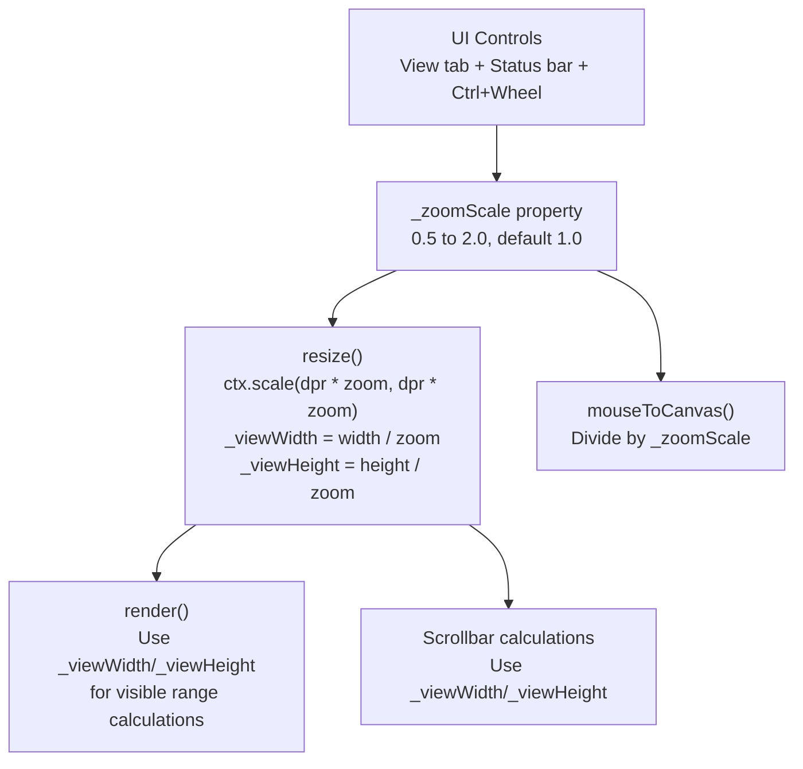

# XLSX Zoom

## Current State

- No zoom code exists anywhere in the codebase
- Canvas uses `devicePixelRatio` scaling only (`ctx.scale(dpr, dpr)` in
  `resize()` at line ~2915 of
  [renderer.ts](src/vs/workbench/contrib/void/browser/documentViewers/xlsxRustViewer/media/renderer.ts))
- `mouseToCanvas()` (line 755) converts mouse events to canvas coordinates
  without zoom
- `hitTestCell()` (line 1504) maps canvas coords to cells using scroll offset
  and `_colPos`/`_rowPos` arrays
- `handleWheel()` (line 1489) only handles scrolling, no Ctrl+Wheel
- View tab in ribbon has Show, Window, and Workbook Views groups -- no zoom
  controls
- Status bar exists with selection stats (right-aligned flex layout in `main.ts`
  line ~3146)

## Architecture

The zoom is implemented as a **canvas transform scale**. All cell dimensions
remain in logical units; the canvas transform handles magnification. This avoids
touching font sizes, line widths, or cell dimension calculations.



## Step 1: Add zoom state and core scaling to `renderer.ts`

### New properties

```typescript
private _zoomScale: number = 1;
private _viewWidth: number = 0;   // width / _zoomScale
private _viewHeight: number = 0;  // height / _zoomScale
```

### Modify `resize()` (line ~2904)

After computing `this.width` and `this.height`, compute view dimensions and
apply zoom to the context scale:

```typescript
this._viewWidth = this.width / this._zoomScale;
this._viewHeight = this.height / this._zoomScale;

const dpr = window.devicePixelRatio || 1;
this.canvas.width = this.width * dpr;
this.canvas.height = this.height * dpr;
this.canvas.style.width = `${this.width}px`;
this.canvas.style.height = `${this.height}px`;
this.ctx.scale(dpr * this._zoomScale, dpr * this._zoomScale);
```

### Modify `mouseToCanvas()` (line ~755)

Divide the result by `_zoomScale` so mouse coordinates map to the logical
drawing space:

```typescript
return {
	x: rect.width > 0 ? (sx * this._viewWidth) / rect.width : sx,
	y: rect.height > 0 ? (sy * this._viewHeight) / rect.height : sy,
};
```

Or equivalently, divide the existing result by `_zoomScale`.

### New public methods

- `setZoom(scale: number)` -- clamps to `[0.25, 4.0]`, stores in `_zoomScale`,
  calls `resize()`, and fires `onZoomChanged` callback
- `getZoom(): number` -- returns `_zoomScale`
- `zoomIn()` -- steps to next preset (e.g., 50% -> 75% -> 100% -> 125% -> 150%
  -> 200%)
- `zoomOut()` -- steps to previous preset
- `zoomToFit()` -- calculates scale to fit the used range in the viewport
- `onZoomChanged: ((scale: number) => void) | null` -- callback for UI to update
  zoom display

### Replace `this.width` / `this.height` with view dimensions

In `render()` (line ~2929), the visible range calculations use `this.width` and
`this.height` to determine `viewBottom` and `viewRight`. These must be replaced
with `this._viewWidth` and `this._viewHeight`:

```typescript
const viewBottom = this.scrollTop + this._viewHeight;
const viewRight = this.scrollLeft + this._viewWidth;
```

Also update:

- Scrollbar thumb size calculations (use `_viewHeight` / `_viewWidth`)
- `hitTestScrollbar()` -- use `_viewWidth` for right edge detection
- `fillRect(0, 0, this.width, this.height)` at the start of `render()` becomes
  `fillRect(0, 0, this._viewWidth, this._viewHeight)`
- Header drawing extents
- Selection drawing extents
- Any other viewport boundary checks

In `resize()`, also ensure the initial `_viewWidth`/`_viewHeight` are set before
calling `render()`.

## Step 2: Ctrl+Mouse wheel zoom in `renderer.ts`

Modify `handleWheel()` (line ~1489):

```typescript
private handleWheel(e: WheelEvent) {
    e.preventDefault();
    if (e.ctrlKey || e.metaKey) {
        const delta = e.deltaY > 0 ? -1 : 1;
        if (delta > 0) this.zoomIn(); else this.zoomOut();
        return;
    }
    // ... existing scroll logic ...
}
```

## Step 3: Zoom controls in View tab (`ribbon.ts`)

In `buildViewTab()` (line ~646), add a **"Zoom"** group after the existing
groups:

- "Zoom In" button -> action `zoomIn`
- "Zoom Out" button -> action `zoomOut`
- "100%" button -> action `zoomReset`
- "Zoom to Fit" button -> action `zoomToFit`
- Dropdown with preset levels: 50%, 75%, 100%, 125%, 150%, 200%

Add SVG icons `IC.zoomIn` and `IC.zoomOut` (magnifying glass with +/-).

## Step 4: Zoom slider in status bar (`main.ts`)

Add zoom controls to the **left side** of the status bar (stats stay
right-aligned):

- A `-` button, a slider (`<input type="range">`), a `+` button, and a
  percentage label (e.g., "100%")
- The slider range is 25-400 (representing percent), default 100
- Changing the slider calls `renderer.setZoom(value / 100)`
- `renderer.onZoomChanged` updates the slider position and label

In `updateStatusBar()` or a new `updateZoomDisplay()` function, sync the slider
with the current zoom.

### Status bar CSS additions

Add to the `#status-bar` styles in
[xlsxRustViewerEditor.ts](src/vs/workbench/contrib/void/browser/documentViewers/xlsxRustViewer/xlsxRustViewerEditor.ts):

```css
.zoom-controls {
	display: flex;
	align-items: center;
	gap: 4px;
	margin-right: auto;
}
.zoom-slider {
	width: 80px;
	height: 2px;
}
.zoom-btn {
	background: none;
	border: none;
	color: inherit;
	cursor: pointer;
	padding: 0 2px;
	font-size: 14px;
}
.zoom-label {
	min-width: 32px;
	text-align: center;
}
```

Change `justify-content` on `#status-bar` from `flex-end` to `space-between` so
zoom controls go left and stats go right.

## Step 5: Wire zoom actions in `main.ts`

Add ribbon action cases:

```typescript
case 'zoomIn': renderer.zoomIn(); break;
case 'zoomOut': renderer.zoomOut(); break;
case 'zoomReset': renderer.setZoom(1); break;
case 'zoomToFit': renderer.zoomToFit(); break;
case 'zoom50': renderer.setZoom(0.5); break;
case 'zoom75': renderer.setZoom(0.75); break;
case 'zoom125': renderer.setZoom(1.25); break;
case 'zoom150': renderer.setZoom(1.5); break;
case 'zoom200': renderer.setZoom(2); break;
```

Hook up `renderer.onZoomChanged` to update the status bar zoom display.

Create zoom slider HTML elements in the init section and add event listeners.

## Key Coordinate Changes Summary

Every place that uses `this.width` or `this.height` as a viewport boundary must
switch to `this._viewWidth` / `this._viewHeight`. The key locations in
`renderer.ts` are:

- `render()` -- visible range calculation, background fill, header extents
- `_drawColumnHeaders()` / `_drawRowHeaders()` -- extent limits
- `hitTestScrollbar()` -- scrollbar position detection
- Scrollbar drawing / thumb calculation
- Selection overlay boundaries
- Frozen pane split calculations
- Page break line drawing
- Outline button positioning

`mouseToCanvas()` is the single gateway for all mouse-to-logical coordinate
conversions, so fixing it once fixes all hit testing (cell clicks, resize, fill
handle, scrollbar, etc.).

## Files to Change

- [renderer.ts](src/vs/workbench/contrib/void/browser/documentViewers/xlsxRustViewer/media/renderer.ts)
  -- `_zoomScale`, `_viewWidth`/`_viewHeight`, modify `resize()`,
  `mouseToCanvas()`, `render()`, `handleWheel()`, add
  `setZoom()`/`zoomIn()`/`zoomOut()`/`zoomToFit()`/`getZoom()`/`onZoomChanged`,
  replace `this.width`/`this.height` viewport references
- [main.ts](src/vs/workbench/contrib/void/browser/documentViewers/xlsxRustViewer/media/main.ts)
  -- wire zoom actions, create status bar zoom controls, hook `onZoomChanged`
- [ribbon.ts](src/vs/workbench/contrib/void/browser/documentViewers/xlsxRustViewer/media/ribbon.ts)
  -- Zoom group in View tab with zoom buttons and preset dropdown
- [xlsxRustViewerEditor.ts](src/vs/workbench/contrib/void/browser/documentViewers/xlsxRustViewer/xlsxRustViewerEditor.ts)
  -- CSS for zoom controls in status bar, adjust `#status-bar` layout

## Build

TypeScript only -- no Rust/WASM changes needed. Run `node media/build.mjs` from
the xlsxRustViewer directory.
